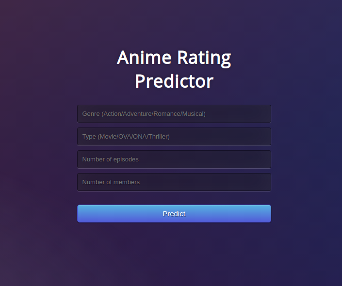
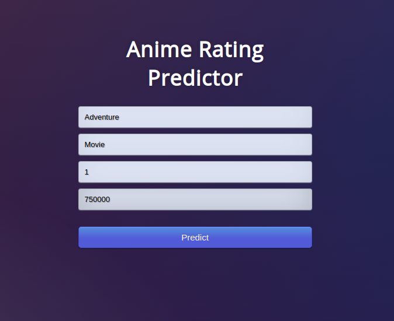
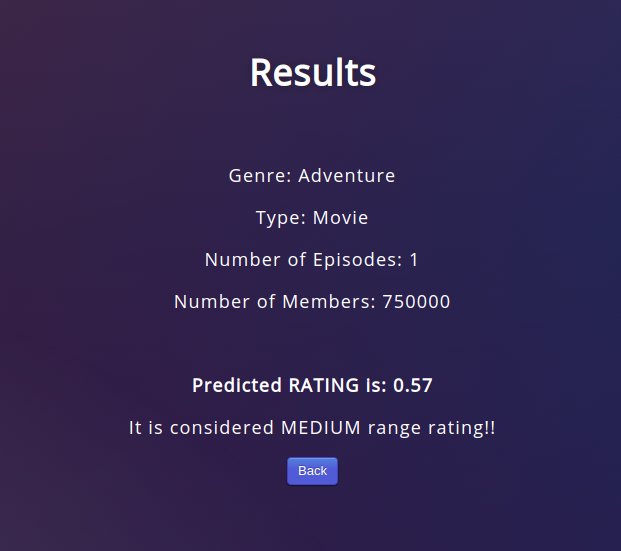

# Machine Learning - Project 1
## Anime Rating Predictor

### Context

The data set contains information on user preference data from 73,516 users on 12,294 anime. Each user is able to add anime to their completed list and give it a rating and this data set is a compilation of those ratings.

The Exploratory Data Analysis was done on the dataset to determine the importance of the features as well as the different techniques used to clean and select them it.

Decision tree, kNN, Multi Layer Perceptron, Random Forest, Support Vector Machine and AutoML estimators were used to compare their accuracy when making predictions on the Dataset.
 
A serializable version of the model was created into dt_model.pkl by executing:

python model.py

The main page of the UI is present as following:

After including the values:

The final result (rating prediction) is given:

