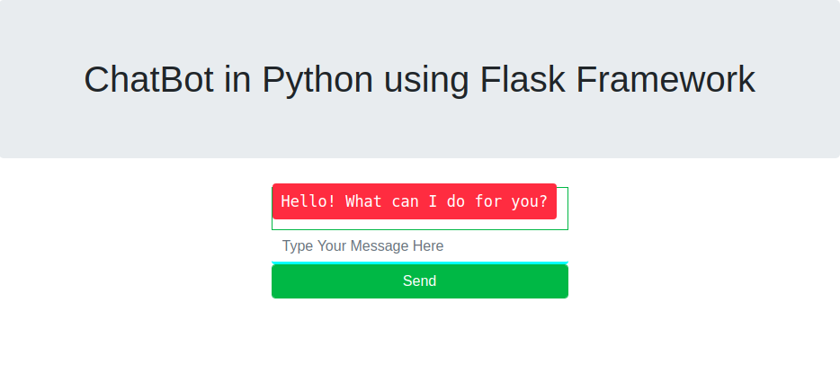
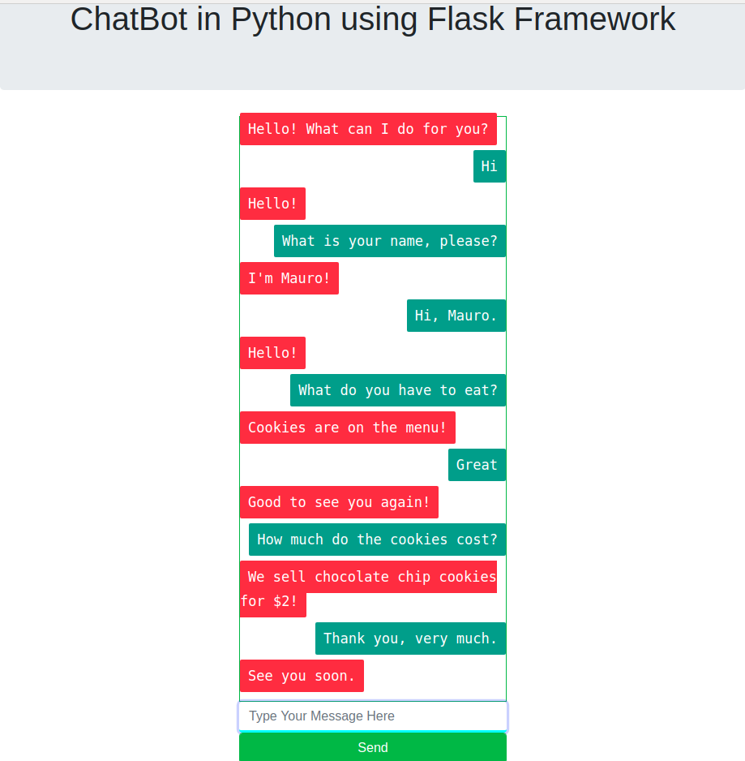
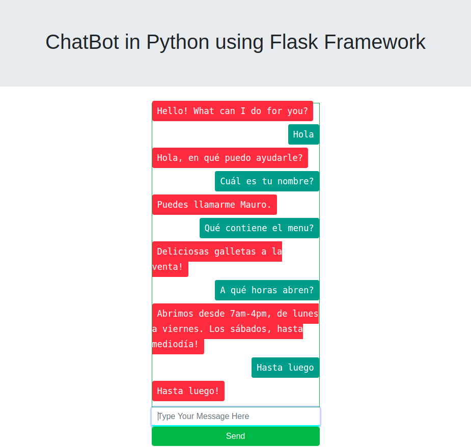
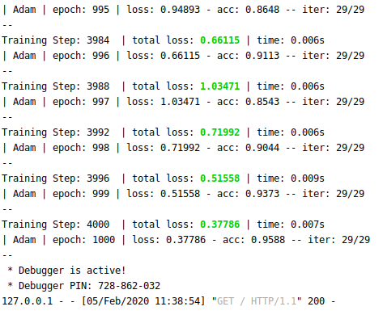

# Machine Learning - NLP Project/App

## NLP Contextual ChatBot

### Context

The aiming of this analysis is to develop a tool to detect the intents of the user in order to offer the required information queried.

The detection is done on written comment that is language detected and fetchs the contentx  associated.

The task is to clearly identify and predict the comments given to offer a fast answer in accordance.

### Dataset

The dataset is generated as .json files from where a Deep Neural Network is trained with the assosiactedtags that filled with context patterns.

This lets the service provider offer the framed information to guide the client (after analyzing the query provided) and give an accurate answer (based on probabilities) in respect to the requirements.


To run the pretrained model:

```
python app.py
```

## Graphical User Interface

#### The main page of the UI is present as following:


------

#### After including the text:


------

#### It is able to detect pretrained the language:


------

### Conclusion

#### The DNN model worked in this kernel, once done the featured engineering and tunned is able to predict the content written by the user with an accuracy of 96.0% after traning on the context(s) and language(s) required.


------
 
