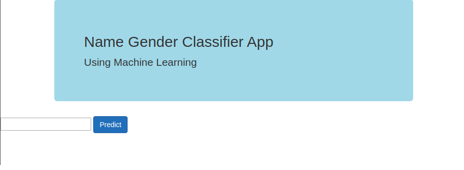
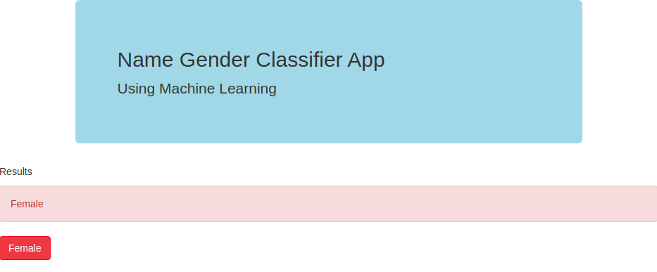
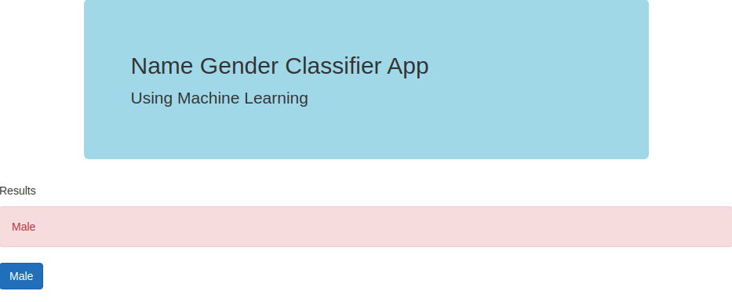

# Machine Learning - NLP Project/App

## NLP Name-Gender Classifier

### Context

The aiming of this analysis is to develop a tool to detect the Gender associated with a name given by the user of the platform.

The classification is performed on the written names based on the pretrained classiffier model (Multinomial Naive Bayes).

The job is to clearly identify and predict the gender given a name introduced from a .csv file with names from different nationalities.

### Dataset

The dataset is generated as .csv files with more than 95'000 names from various nationalities where the model is trained with the associated class.

The name is provided from the user in order for the pretrained model to analyze the input data and give an accurate prediction based on probabilities of the gender associated.


To run the pretrained model:

```
python app.py
```

## Graphical User Interface

#### The main page of the UI is present as following:


------

#### After including the text, the result is given:


------

#### It scrutinizes the comment structure and is able to detect if the input text belongs to a gender or not:


------


### Conclusion

#### The Multinomial Naive Bayes model worked in this kernel, once done the featured engineering and tunned is able to predict the content written by the user with accuracy after traning on the dataset of binary class labeled names.

 
