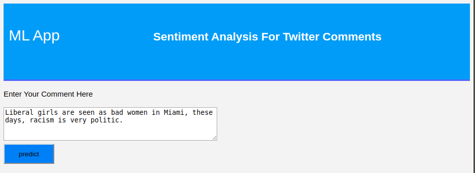

# Machine Learning - NLP Project/App

## NLP Sentiment Analysis

### Context

The aiming of this analysis is to develop a tool to detect racist or sexist speech in tweets.

As a simple approach, this detection is done on a tweet that contains hate speech in it, related to racist or sexist sentiment associated.

Hence, the work is to clearly classify and predict racist or sexist tweets from other tweets.

### Dataset

The dataset of tweets was split in the ratio of 65:35 into training and testing data. Out of the testing data, 30% is public and the rest is private.

**train.csv** - For training the models, it is provided a labelled dataset of 31,962 tweets in the form of a csv file with each line storing a tweet id, its label and the tweet.

**test_tweets.csv** - It contains the test data file with only tweet ids and the tweet text with each tweet in a new line.

A serializable version of the model was created into dt_model.pkl by executing:

```
python model.py
```

To run the pretrained model:

```
python app.py
```

## Graphical User Interface

#### The main page of the UI is present as following:


------

#### After including the text:


------

#### The final result (Sentiment prediction) is given:


------

#### When typing a different comment with no regular content:


------

#### The prediction is given:


------

### Conclusion

#### The logistic regression model worked in this kernel, once done the featured engineering and tunned is able to predict the content (sentiment involved) from a regular tweet in opposition to a racist/sexist one and viceversa with an accuracy of 95.0%. (As presented in the Colab notebook).
