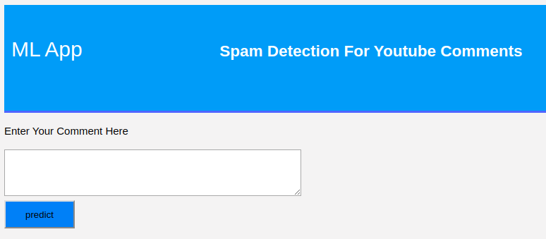
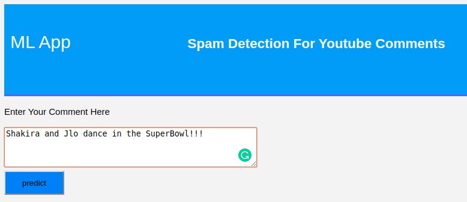
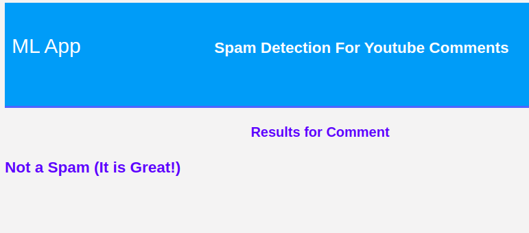
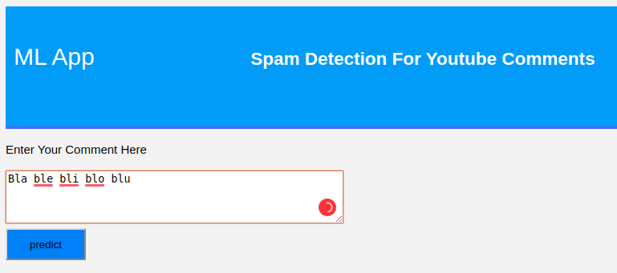
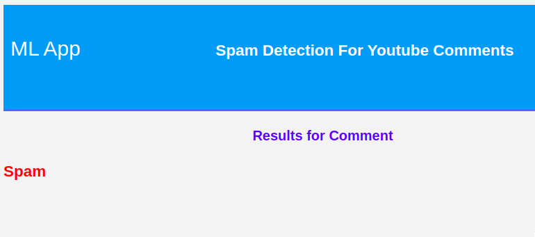

# Machine Learning - NLP Project/App

## NLP Spam Detector

### Context

The aiming of this analysis is to develop a tool to detect the Spam comments on the platform for the user in order to avoid disrupt the information to be stored.

The classification is performed on the written comment based on the pretrained classiffier model (Multinomial Naive Bayes).

The job is to clearly identify and predict the comments given, to predict whether the comment is considered Spam.

### Dataset

The dataset is generated as .csv files from public comments from youtube where the model is trained with the associated class.

The provider offer the security of the vast comments provided from the users in order to analyze the input data and give an accurate hint based on probabilities over the inclussion/procession of the information provided.


To run the pretrained model:

```
python app.py
```

## Graphical User Interface

#### The main page of the UI is present as following:


------

#### After including the text:


------

#### It scrutinizes the comment structure and is able to detect if the comment is Spam or not:


------

#### After including the new text:


------

#### The trained model is able to detect the nature of the comment:


------

### Conclusion

#### The Multinomial Naive Bayes model worked in this kernel, once done the featured engineering and tunned is able to predict the content written by the user with accuracy after traning on the dataset of class labeled commets.

 
