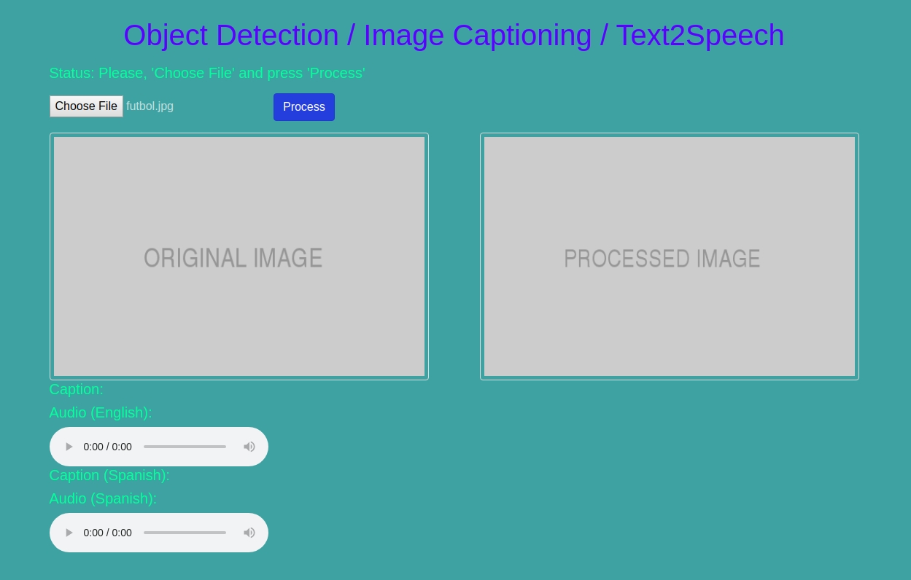
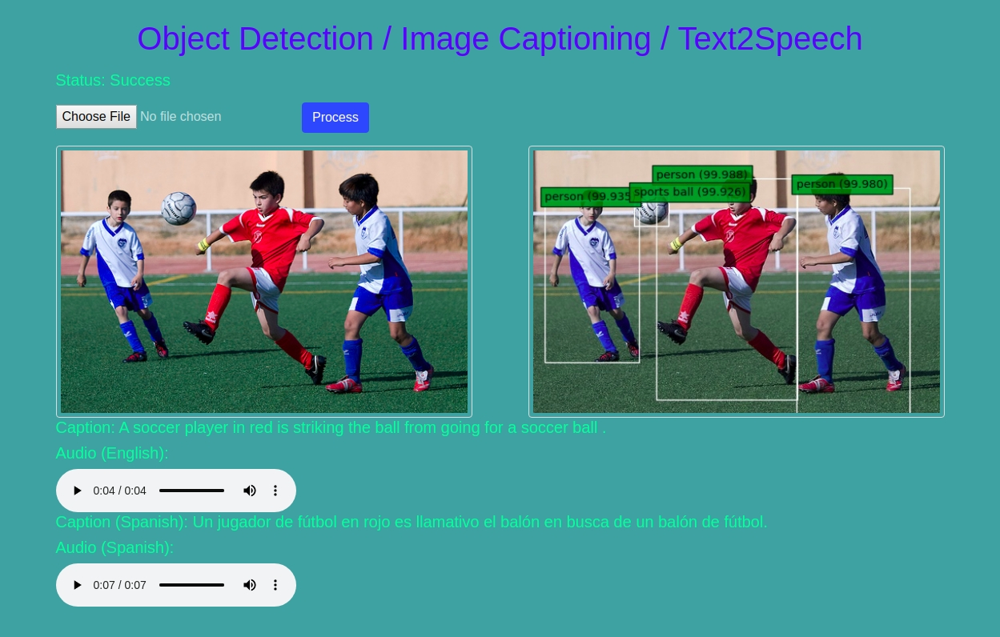

# Machine Learning - Project 3

## Vision Image Captioning

### Context

Vision Image Captioning System using Flilckr8K dataset which contains 8,000 images that are each paired with five different captions. They provide clear descriptions of the random events. and they tend not to contain any well-known people or locations, to represent a variety of situations.

### Exploratory Data Analysis Performed.

Data preparation.

Common words exploration.

Vocabulary generation from caption.

Image preparation.

Photo feature sense.

## Model generation and prediction

Model training

Model Validation

Generating prediction

### Running Environment

colab.research.google.com

Runtime type: Python3 Google

Compute Engine Backend

Hardware accelerator: GPU

## You Only Look Once version 3 (YOLOv3)

Hyper parameters Value

* Batch normalization: epsilon 0.001
* Leaky-ReLU: alpha 0.1
* Model size: 460 x 460
* Anchors: (width, height) Scale3: [[116,90, 156,198, 373,326], Scale2: [30,61, 62,45, 59,119],Scale1: [10,13, 16,30, 33,23]]
* Object Detection Threshold: 0.6
* Non-max suppression IOU: 0.5
* Model pre trained weights: yolo3.weights

### Image Captioning (CNN-LSTM):

* Keras With Tensorflow back-end
* InceptionV3 for encoding – transfer learning
* LSTM for decoding
* Greedy as well as Beam search was used.

Hyper parameters Value:

* Embedding size: 300
* Vocabulary size: 8256
* Dropout: 0.5
* Batch Size: 128
* LSTM 1 Output: 256
* LSTM 2 Output: 1000
* Epochs: 10
* Model weights: Inceptionv3 weights

### Execution

```
python main.py
```

### Graphical User Interface

The main page of the UI is present as following:



The final results (image detection / captioning / text2speech) are given:



### Text2Speech

<a href="futbol.mp3">Audio (English)</a>

<a href="futbol_sp.mp3">Audio (Spanish)</a>


